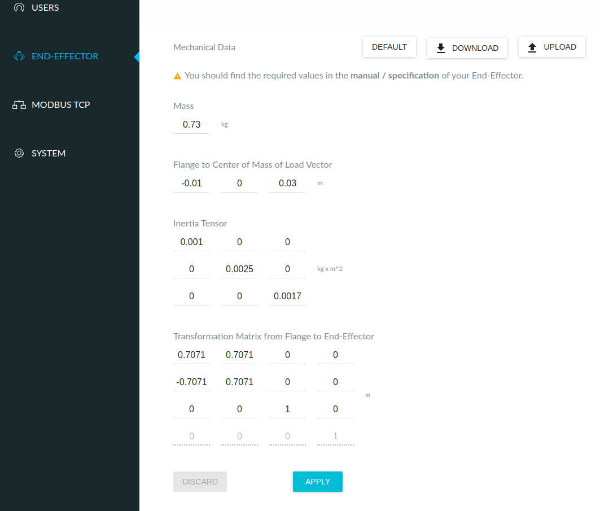

# Assembly Dual Controller Package
It contains ros control modules for controlling Franka-Emika panda robots. This package provides not only dual controllers but also single and triple controllers. (The name is just a legacy thing)

**Required FCI version: 4.0.X**


## Prerequisite
* libfranka 0.8.0 (https://github.com/frankaemika/libfranka)
```sh
# go to the home directory
cd ~/ 
# git clone
git clone --recursive https://github.com/frankaemika/libfranka -b 0.8.0
# enter the directory
cd libfranka
# update submodules
git submodule update
# prepare a build directory
mkdir build
cd build
# build
cmake .. -DCMAKE_BUILD_TYPE=RELEASE
make -j9
```

* franka_ros **develop branch** (https://github.com/psh117/franka_ros)
```sh
# go to the catkin source directory
cd catkin_ws/src
# git clone
git clone --recursive https://github.com/psh117/franka_ros -b develop
# build
catkin build franka_ros -DCMAKE_BUILD_TYPE=Release -DFranka_DIR:PATH=~/libfranka/build
source devel/setup.sh
```

## Franka Settings
Set the end-effector translation to 0


## Installation

```sh
cd ~/catkin_ws
catkin build assembly_dual_controllers -DCMAKE_BUILD_TYPE=Release # -D~ is needed only for the first time
```


## Launch

```sh
# single
roslaunch assembly_dual_controllers assembly_controller_single.launch

# dual
roslaunch assembly_dual_controllers assembly_controller_dual.launch

# triple
roslaunch assembly_dual_controllers assembly_controller_tripple.launch
```